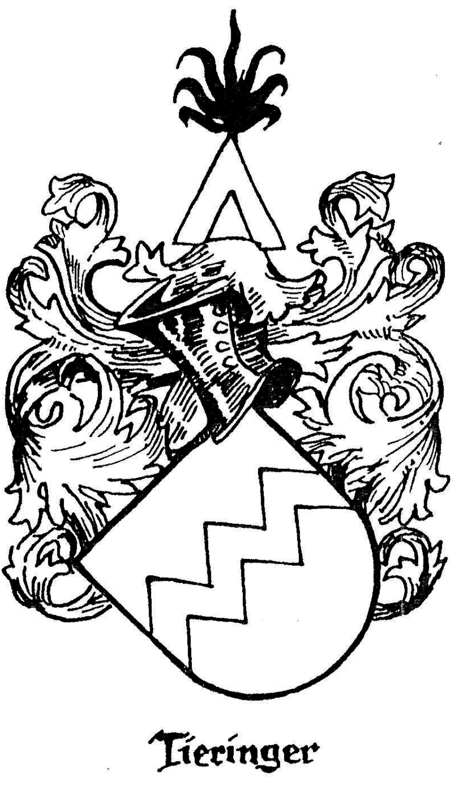

############################################
Wappen der Familien Thieringer - Dieringer
############################################

Dass über ein Wappen der Familien Thieringer-Dieringer die Ansichten stark auseinander gehen, zeigt schon ein flüchtiger Blick auf das Vorhandene: Während in den führenden Wappenwerken (Siebmacher, Alberti) die Wappen des Thieringer Adelsgeschlechts in zwei ähnlichen Formen nachgewiesen sind, stiess der Verfasser im Verlauf seiner Forschungen noch auf drei weitere Wappen, die alle im Folgenden näher beschrieben und beurteilt werden sollen.

Bis jetzt ist nicht bekannt, ob von einer der Familien (von den Rittern von Thieringen abgesehen) zu irgend einer Zeit ein Wappen, eine Hausmarke oder ein Siegel geführt wurde. Auch heute führt keine Familie ein Wappen. Da ein Zusammenhang unserer Ahnen mit der Thieringer Adelsfamilie des 13.-15. Jahrhundert kaum nachzuweisen ist, so sind die in der vorliegenden Schrift aufgeführten Familien nicht berechtigt, deren Wappen zu führen. Dazu wäre ein sogenannter "Wappenbrief" nötig, d.h. eine Urkunde, durch die etwa einem Familienverband die Wappenfähigkeit und das Recht zur Führung eines bestimmten Wappens verliehen wird.

Solange also nicht alle Verbandsmitglieder das gleiche Wappen zu führen sich verpflichten, bzw. ein- und dasselbe Wappen mehrere Generationen hindurch geführt worden ist, kann von einem "Familienwappen" nicht gesprochen werden.

Die Wappen der Thieringer Adelsfamilie

Wappen des Ortsadels "von Thieringen"
=====================================

#.	In J. Siebmacher: "Wappenbuch" (Nürnberg 1911; erstmals erschienen im Jahr 1596) heisst es in Band VI. 2, welcher die abgestorbenen Württembergischen Adelsgeschlechter behandelt (S.141):

	Thieringen. Lehensmannen der Grafen von Hohenberg.

	**Wappen** (nach der Züricher Wappenrolle): In Blau ein silberner Zickzackbalken.

	**Helm**: ein goldener Sparren, oben mit schwarzem Hahnenbusch besteckt.

	**Decken**: einfarbig rot.

	Denselben Schild in umgekehrten Farben gibt das :index:`Werningeroder Wappenbuch`;

	**Helm**: geschlossener silberner Flug, das Wappenbild wiederholend.

	**Decken**: blau, silber."

	Die auf Tafel 77 enthaltenen zwei Abbildungen sind anschließend wiedergegeben.

#.	Das Werk von Otto von Alberti: ":index:`Württembergisches Adels- und Wappenbuch`" (Stuttgart, Kohlhammer, 1899-1916), 2. Band führt S. 829 auf:

	Thieringen. Gräflich Hohenbergische Dienstmannen 1285-1459. O.A.

	Beschr. Balingen S. 214, 342, 350, 363, 433, 499-500, 501; neue O.A. Beschr. Rottenburg II, 297, 355; Rottweil 361 (?); Spaichingen 354; Kindler v. Knobloch: "Oberbadisches Geschlechterbuch" I, 224.

	.. _ref_siegel_walter_von_thieringen:

	.. figure:: ./images/siegel_walter_von_thieringen.*
		:width: 150px
		:align: right

		Siegel des Walter von Thieringen, 1551

	Ausserdem enthält es das Thieringer-Wappen nach der Züricher Wappenrolle (wie Siebmacher), sowie auch die in der Grafik :ref:`ref_siegel_walter_von_thieringen` gezeigte kleine Wiedergabe.

#.	Das "Oberbadische Geschlechterbuch" von J. Kindler v. Knobloch, 1. Bd (Heidelberg 1898), S. 224, enthält folgende Angaben:

	**von Tieringen, Thieringer**: Nach dem Dorfe Thieringen im Württembergischen :term:`OA` Balingen nannte sich ein Lehensmannengeschlecht der :index:`Grafen von Hohenberg`, welches in Oberbadischen Urkunden häufig vorkommt.

	*	:index:`Ruopertus de Tyringun` 1162.
	*	:index:`Roupertus de Tiuringin` 1171, Z. Urk. :index:`Salem`,
	*	Zwei Brüder :index:`Werner von Thieringen` 1281.
	*	:index:`Dietrich der Tieringer` 1305, 1308, Kirchherr zu :index:`Friedingen`.
	*	:index:`Friedrich von Thieringen` 1338.
	*	:index:`Jäcklin`, 1338 Hohenberg'scher Diener, tot 1351; seine Söhne 1351: Dietrich, Walter, Jacob und Hugo.
	*	:index:`Gertrud von Bubenhofen`, Jacob des Tieringer's Witwe, verzichtete 1344 auf einen Hof in Owingen an Kloster Alpirsbach.
	*	:index:`Dietrich der Thieringer`, R., 1359.
	*	Hans Ulrich von Thieringen 1365.
	*	Dietrich Dieringer, Ek., 1366 Z. in :index:`Freiburg`, 1373 Bürge für den Grafen in Freiburg.
	*	:index:`Konrad Tieringer`, 1382 des Gerichts in Freiburg.
	*	:index:`Konrad von Tieringen`, Conventherr zu :index:`Alpirsbach`, und die minderjährigen Kinder seines + Bruders :index:`Dietrich von Tieringen`.
	*	:index:`Fritz der Tieringer`, 1397.
	*	Frau Clara Tieringerin besass 1405 Gülten in :index:`Bötzingen`.
	*	:index:`Diethelm der Tieringer`, 1405, 1427.
	*	:index:`Werner von Tieringen`, Ek., 1426, führte im Schilde einen viermal sparrenweise gebrochenen Balken.
	*	:index:`Peter Tieringer`, 1428 des Raths in :index:`Kenzingen`.
	*	Werner von Tieringen, 1455 Vogt zu :index:`Hechingen`, Oheim des Peter Eminger.
	*	Junker Rudolf von Tieringen 1446.
	*	Die Brüder Werner und Hans von Tieringen 1447 wegen Gütern im Eisass.
	*	Der veste :index:`Werner von Tieringen` empfing 1458 nach dem Tode seines Vetters :index:`Fritsch von Tieringen`, Rappoltstein. Amtmann's zu :index:`Gemar`, dessen Rappoltstein'sches Mannslehen, ein Haus zu Gemar, wogegen ihm nach seinem Tode sein Bruder :index:`Hans von Tieringen` in den Österreichischen Lehen im Elsass folgte.
	*	:index:`Afra Hauß`, geborene Tieringer zu Freiburg 1504.
	*	:index:`Jacob Tieringer` 1507 Bürger in :index:`Breisach`.
	*	:index:`Peter von Dieringen`, Österreichischer Lehensmann 1535.

**Wappen**: In Blau ein dreimal sparrenweise gebrochener silberner Balken; auf rotem Kübelhelm ein mit einem schwarzen Hahnenfederbusch besetzter goldener Sparren. (Züricher Wappenrolle, Nr. 328)."

(Es findet sich in diesem Werk auch eine Abbildung des Wappens).

Dieses Wappen der Ritter von Thieringen findet sich seit Jahren in Haus des Rechtsanwalts :index:`Werner Dieringer` in :index:`Rottweil`, des evangelischen Pfarrers :index:`Kurt Thieringer` in :index:`St. Georgen` (hier auch als Siegel), und neuerdings auch in der evangelischen Dorfkirche in :index:`Tieringen` Kreis Balingen. Ihm kommt zweifellos die grösste Bedeutung zu.

Andere (angebliche) Thieringer-Wappen:
======================================

.. figure:: ./images/wappen_dueringer.*
	:width: 150px
	:align: right

	(Zeichnung: Knayer)

#.
	Dem Aufsatz des Namensforschers J.K. Brechenmacher über **"Die Düring, Dieringer, Thieringer, Deuring, Theuringer"** (erschienen im Stuttgarter NS-Kurier vom 4.5.1940) ist am Rande die Abbildung eines Wappens beigefügt, bei dem es u.a.heisst:

	Wappen der Familie Dieringer. Bekanntlich nennt man Wappen, deren Figuren eine Anspielung auf den Namen enthalten, "redende Wappen". Dabei kann die gedankliche Verbindung zwischen Figur und Namen naheliegen. Die Anspielung kann aber auch weit hergeholt sein.

	Auch heute zeigen wir ein redendes Wappen, bei dem die Wahl der Hauptfigur, einess **dürren**‚ unbelaubten Baumes, nicht als glücklich bezeichnet werden kann. Es handelt sich um das dem Siebmacher'schen Wappenbuch entnommene Wappen der Dieringer (Düringer), eines angeblich in Bern beheimateten Geschlechts, das zahlreiche Ausläufer auch nach Württemberg entsandt hat".

	--- Sch.

#.
	Auf dem vom Verfasser Otto Dieringer in Balingen entdeckten grossen **"Stammbaum der Familie Thieringer - in Balingen, Erzingen und Ravensburg - 7 Geschlechter von 1690-1907."** der im November 1907 von einem :index:`Carl Beck` in Ebingen sorgfältig gefertigt wurde, findet sich am Rande ebenfalls ein, **"Familien-Wappen Thieringer"**, und zwar ein aufgerichteter Löwe, der einen Hut oder ähnliches zu halten scheint.

	Spangenhelm; Helmzier: wachsender Löwe, ein Kruzifix haltend.

	Unten ist als Erläuterung vermerkt:

	.. epigraph::

		**Wappen Türinger**. Von einem alten Gemälde mit Inschrift "Gall Türing aus Bregenz", den 28. Februar 1605

	Ausserdem ist folgender Auszug aus der :index:`Crusischen Chronik` angefügt:

	.. epigraph::

		Anno 1351 ... an Sankt Johannis Abend ... geben zu Balingen.

		In diesem Brief seynd 4 Brüder: Theodorius, Walther, Jakob und Hugo, Jacklin's (Jacobeli) seelig Söhne "von Thieringen", welche von dem Kloster Alpirsbach mit etliche Pfund bewährte Müntzen über einen Streit wegen eines Hofs zu Owingen, "Kaltershofers Hof" genannt, befriedigt worden und lieblich, mineklich und gütlich (wie es in dem Brief heisst) geschieden.

		Theodorius und Walther hängten ihre Siegel an, auch vor Jakob und Hugo, denn sie hatten noch keine eigenen Insiegel, dieweil sie noch nicht zu ihren Tagen gekommen waren.

		Auf ihr Begehren unterschrieben auch "Herrn Dieterich, Kirchherr von Owingen."

	Dieser Auszug wirft also einiges Licht auf die im "Oberbadischen Geschlechterbuch" enthaltenen Angaben über Jäcklin's Söhne, wobei der Name Theodorius bzw. Dietrich fraglich scheint.

#.
	Ein grosses, schönes "Wappen der Familie Dieringer" befand sich 1938 noch in Stuttgart im Besitz einer Familie des :index:`Gunninger Zweig`\ es, die heute in :index:`Schöckingen` Kreis Leonberg wohnt. Es wurde gefertigt von einen Stuttgarter "Wappen- und Stammbaum-Maler Franz Reich.

	Der geteilte Schild trägt oben in Gold vier rote Schrägrechtsbalken, unten in Blau einen waagrechten Anker;Stechhelm; Adelskrone mit 5 sichtbaren Sternen; Helmzier: wachsender Arm, die Hand einen waagrechten Anker haltend;

	Als Erläuterung ist unten angefügt:

	.. epigraph::

		Dieringer stammt ursprünglich aus einen alten, vornehmen Geschlecht des 15. Jahrhunderts aus Hohenzollern. :index:`Johann Christof Dieringer` des Raths zu :index:`Sigmaringen` starb im Jahr 1551 daselbst.

	(Die letztere Angabe klingt sehr unwahrscheinlich und wurde bisher nicht bestätigt).

	Nach einer Notiz sollen die Farben bedeuten:

	rot
		hohe Ehre

	gelb
		Vornehmheit

	blau
		Bescheidenheit

	Ferner soll der Arm angeblich auf eine merkwürdige Begebenheit hindeuten.

	Wenn auch dieses Wappen kunstvoll gemalt ist, so scheint es doch nur ein Phantasie-Erzeugnis zu sein, dem keine weitere Bedeutung zukommt.

	Schon diese wenigen Beispiele zeigen, wie gross der Spielraum ist, und welche Vorsicht geboten ist, wenn von einem "Dieringer-Wappen' geredet wird. In Ganzen gesehen dürfte für uns das blau-weisse Wappen derer "von Thieringen" noch am meisten Recht haben.

.. admonition:: Erläuterungen

	Über **Wappen** sei allgemein noch einiges bemerkt: Wappen sind bleibende, erbliche, nach bestimmten Regeln zusammengestellte, im christlichen Abendland im 12. Jahrhundert aufgekommene Abzeichen einer Person, einer Familie oder einer Körperschaft; sie bedeuteten ursprünglich Abzeichen auf Waffen, die im Felde von Heerführern wie einzelnen Rittern zur Unterscheidung und Erkennung getragen wurden. (Schild, Helm).

	Wesentlich ist das jeweilige Wappenbild und die Farben. Die Farben wurden wegen des kleinen Raumes grell gewählt;die Bilder mussten wegen der Fernwirkung stilisiert werden.

	Im übrigen ist die Wappenkunde, die sogenannte "Heraldik" (nach dem Wort Herold, der früher Abgesandter des Fürsten war), ein Spezialgebiet, das bestimmte Fachkenntnisse voraussetzt.

.. figure:: ./images/wappen-thieringen-zuericher-wappenrolle.*
	:height: 400px
	:align: left

	Züricher Wappenrolle

.. figure:: ./images/wappen-thieringen-werningeroder-wappenbuch.*
	:height: 400px
	:align: right

	Werningeroder Wappenbuch

	Skizze der "Heraldische Beratungsstelle", Stuttgart, 1958

